# 🔢 Đồ án cá nhân: 8-Puzzle Solver

## 1. Mục tiêu
Xây dựng một chương trình giải bài toán **8-Puzzle** sử dụng nhiều thuật toán tìm kiếm trong lĩnh vực Trí tuệ nhân tạo, bao gồm các nhóm:
- Tìm kiếm không có thông tin.
- Tìm kiếm có thông tin.
- Tìm kiếm cục bộ.
- Tìm kiếm trong môi trường phức tạp.
- Tìm kiếm ràng buộc.
- Học tăng cường.

---

## 2. Nội dung

### 2.1. Các thuật toán tìm kiếm không có thông tin: BFS, DFS, UCS, IDDFS

#### Thành phần chính của bài toán tìm kiếm
- **Không gian trạng thái**: Các trạng thái của bảng 3x3, với các số từ 0 đến 8, trong đó 0 là ô trống. Mỗi trạng thái là một cách sắp xếp khác nhau của các ô.
- **Trạng thái ban đầu**: Một trạng thái hợp lệ, alf điểm xuất phát của quá trình tìm kiếm( trong bài sử dụng: `[[1, 8, 2], [0, 4, 3], [7, 6, 5]]` ).
- **Trạng thái đích**: Là một trạng thái mà ta mong muốn đạt được( trong bài sử dụng: `[[1, 2, 3], [4, 5, 6], [7, 8, 0]]`).
- **Hành động**: Di chuyển ô trống lên, xuống, trái, phải (nếu hợp lệ).
- **Chi phí**: Mỗi bước di chuyển có chi phí là 1.
- **Solution**: Một chuỗi các trạng thái từ trạng thái ban đầu đến trạng thái đích.

#### Hình ảnh GIF minh họa
| Thuật toán | GIF |
|------------|-----|
| **BFS** | 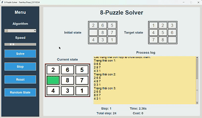 |
| **DFS** |  |
| **UCS** |  |
| **IDDFS** | 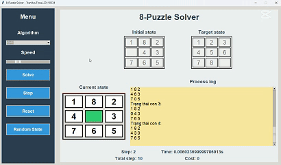 |

#### Hình ảnh so sánh hiệu suất
| Thời gian | Số trạng thái đã thăm | Bộ nhớ sử dụng |
|-----------|-----------------------|----------------|
| 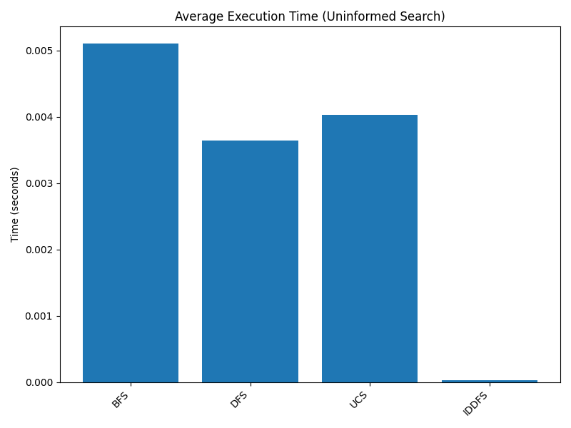 | 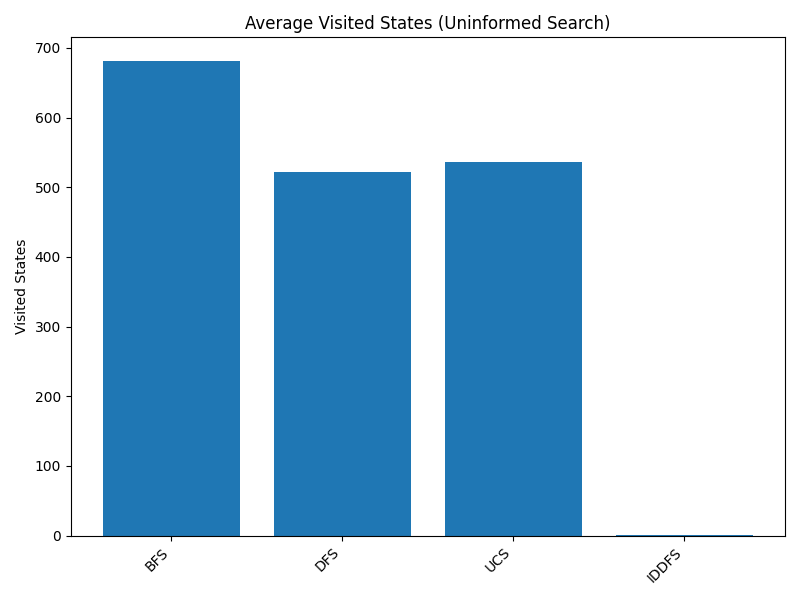 | 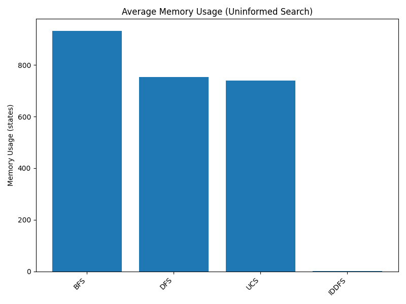 |

#### Nhận xét về hiệu suất
- **BFS**: Đảm bảo tìm được đường ngắn nhất nhưng tốn nhiều bộ nhớ do lưu trữ tất cả trạng thái ở mỗi mức độ sâu. Phù hợp khi không gian trạng thái không quá lớn.
- **DFS**: Nhanh trong việc tìm giải pháp nhưng không đảm bảo đường đi ngắn nhất, dễ bị kẹt ở các nhánh sâu vô hạn nếu không kiểm soát.
- **UCS**: Tương tự BFS nhưng linh hoạt hơn với chi phí tùy chỉnh. Hiệu quả khi cần tối ưu chi phí nhưng vẫn tốn bộ nhớ.
- **IDDFS**: Kết hợp ưu điểm của BFS (đảm bảo đường ngắn nhất) và DFS (tiết kiệm bộ nhớ), hiệu quả cho bài toán 8-Puzzle với không gian trạng thái vừa phải.

---

### 2.2. Các thuật toán Tìm kiếm có thông tin: GREEDY, A*, IDA*

#### Thành phần chính của bài toán tìm kiếm
- **Không gian trạng thái**: Các trạng thái của bảng 3x3, với các số từ 0 đến 8, trong đó 0 là ô trống. Mỗi trạng thái là một cách sắp xếp khác nhau của các ô.
- **Trạng thái ban đầu**: Một trạng thái hợp lệ, alf điểm xuất phát của quá trình tìm kiếm( trong bài sử dụng: `[[1, 8, 2], [0, 4, 3], [7, 6, 5]]` ).
- **Trạng thái đích**: Là một trạng thái mà ta mong muốn đạt được( trong bài sử dụng: `[[1, 2, 3], [4, 5, 6], [7, 8, 0]]`).
- **Hành động**: Di chuyển ô trống lên, xuống, trái, phải (nếu hợp lệ).
- **Chi phí**: Mỗi bước di chuyển có chi phí là 1. Đồng thời Sử dụng hàm heuristic (khoảng cách Manhattan) để ưu tiên các trạng thái gần trạng thái đích hơn.
- **Solution**: Một chuỗi các trạng thái tối ưu hóa chi phí dựa trên heuristic và chi phí thực tế.

#### Hình ảnh GIF minh họa
| Thuật toán | GIF |
|------------|-----|
| **GREEDY** |  |
| **A*** | 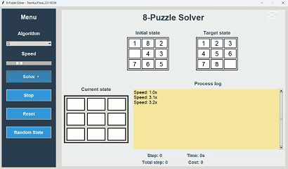 |
| **IDA*** |  |

#### Hình ảnh so sánh hiệu suất
| Thời gian | Số trạng thái đã thăm | Bộ nhớ sử dụng |
|-----------|-----------------------|----------------|
| 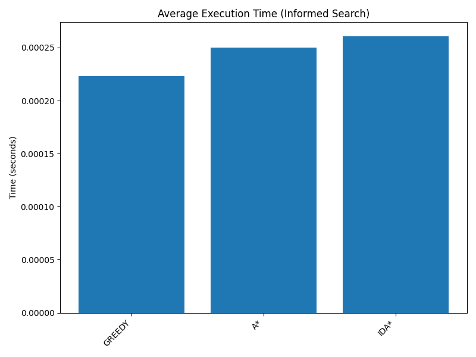 | 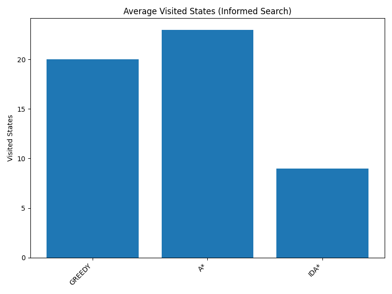 | 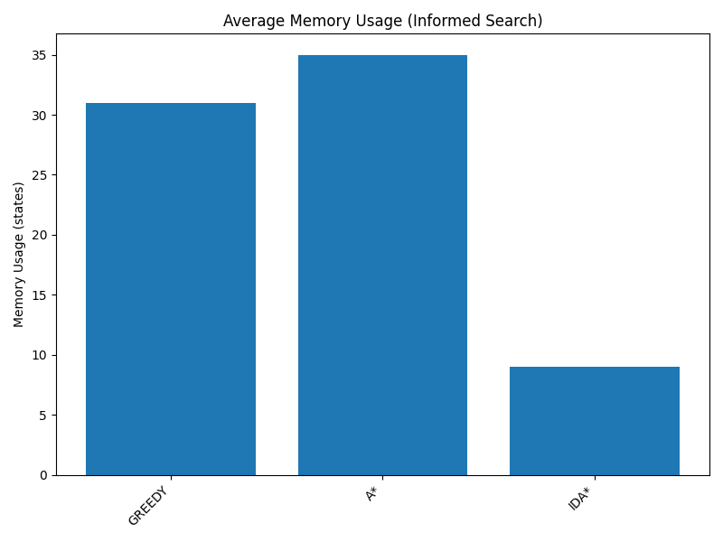 |

#### Nhận xét về hiệu suất
- **GREEDY**: Nhanh nhưng không đảm bảo đường đi ngắn nhất do không xét đến chi phí thực tế , dễ bị kẹt ở cực trị địa phương.
- **A***: Hiệu quả cao, đảm bảo đường đi ngắn nhất với chi phí tối thiểu, nhưng tốn bộ nhớ để lưu trữ danh sách trạng thái đã mở.
- **IDA***: Tiết kiệm bộ nhớ hơn A* do sử dụng giới hạn chi phí, nhưng có thể chậm hơn trong một số trường hợp do tìm kiếm lặp lại, cần heuristic tốt để giới hạn số lần lặp lại.

---

### 2.3. Các thuật toán Tìm kiếm cục bộ: SimpleHillClimbing, SteepestHillClimbing, StochasticHillClimbing, SimulatedAnnealing, BeamSearch, GeneticAlgorithm

#### Thành phần chính của bài toán tìm kiếm
 **Không gian trạng thái**: Các trạng thái của bảng 3x3, với các số từ 0 đến 8, trong đó 0 là ô trống. Mỗi trạng thái là một cách sắp xếp khác nhau của các ô.
- **Trạng thái ban đầu**: Một trạng thái hợp lệ, alf điểm xuất phát của quá trình tìm kiếm( trong bài sử dụng: `[[1, 8, 2], [0, 4, 3], [7, 6, 5]]` ).
- **Trạng thái đích**: Là một trạng thái mà ta mong muốn đạt được( trong bài sử dụng: `[[1, 2, 3], [4, 5, 6], [7, 8, 0]]`).
- **Hành động**: Di chuyển ô trống lên, xuống, trái, phải (nếu hợp lệ).
- **Chi phí**: Mỗi bước di chuyển có chi phí là 1. Trong local search, chi phí này có thể được xem xét gián tiếp thông qua việc so sánh giá trị heuristic giữa các trạng thái lân cận.
- **Solution**: Một chuỗi các trạng thái được tạo ra bằng cách lặp lại việc chọn trạng thái lân cận tốt hơn (dựa trên hàm heuristic) từ trạng thái hiện tại, cho đến khi đạt được trạng thái tối ưu cục bộ (giá trị heuristic thấp nhất có thể) hoặc đáp ứng tiêu chí dừng (đạt trạng thái đích hoặc số lần lặp tối đa).

#### Hình ảnh GIF minh họa
| Thuật toán | GIF |
|------------|-----|
| **SimpleHillClimbing** | 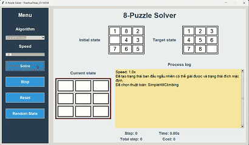 |
| **SteepestHillClimbing** |  |
| **StochasticHillClimbing** |  |
| **SimulatedAnnealing** | 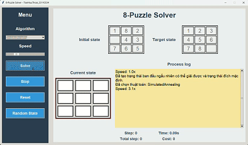 |
| **BeamSearch** |  |
| **GeneticAlgorithm** |  |

#### Hình ảnh so sánh hiệu suất
| Thời gian | Số trạng thái đã thăm | Bộ nhớ sử dụng |
|-----------|-----------------------|----------------|
| 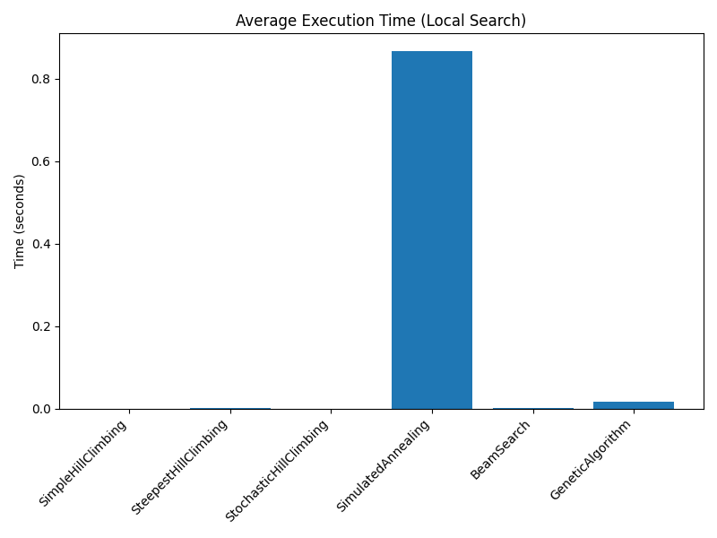 | 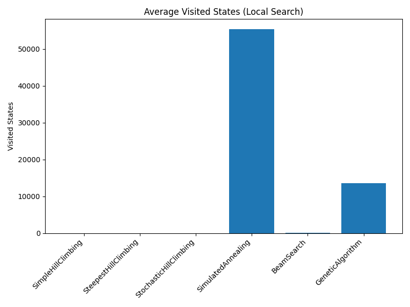 | 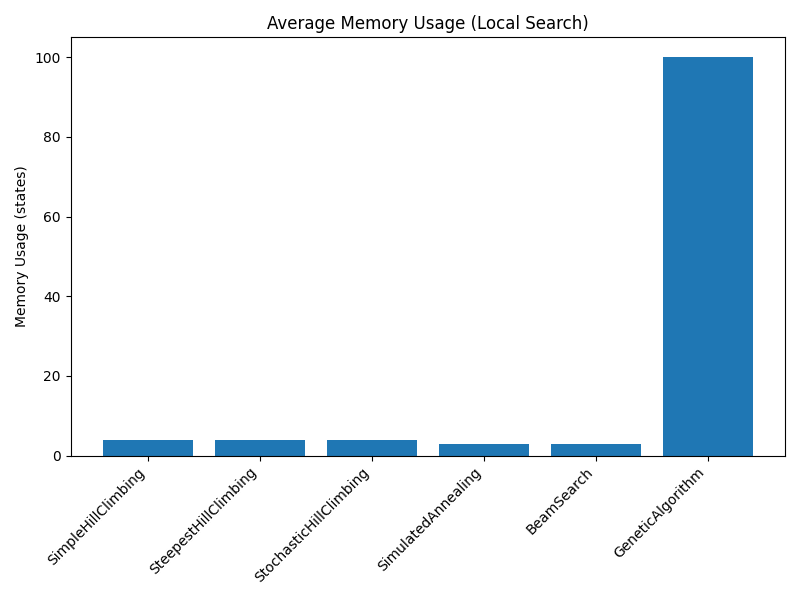 |

#### Nhận xét về hiệu suất
- **SimpleHillClimbing**: Nhanh nhưng dễ kẹt ở cực trị cục bộ, không phù hợp với các bài toán có không gian trạng thái phức tạp.
- **SteepestHillClimbing**: Cải thiện hơn SimpleHillClimbing bằng cách chọn trạng thái lân cận tốt nhất, nhưng vẫn có nguy cơ kẹt.
- **StochasticHillClimbing**: Tăng tính ngẫu nhiên để tránh cực trị cục bộ, hiệu quả hơn trong một số trường hợp nhưng vẫn có nguy cơ kẹt.
- **SimulatedAnnealing**: Có khả năng thoát khỏi cực trị cục bộ nhờ cơ chế chấp nhận giải pháp xấu, nhưng tốn thời gian hơn, bộ nhớ.
- **BeamSearch**: Giới hạn số trạng thái được xem xét, tiết kiệm bộ nhớ nhưng có thể bỏ qua giải pháp tối ưu.
- **GeneticAlgorithm**: Phù hợp với bài toán lớn, nhưng tốn thời gian do cần tạo và tiến hóa quần thể lớn.

---

### 2.4. Các thuật toán Tìm kiếm trong môi trường phức tạp, không xác định: NoObservationSearch, PartialObservationSearch

#### Thành phần chính của bài toán tìm kiếm
-**Không gian niềm tin**:  Là tập hợp tất cả các trạng thái vật lý khả dĩ mà tác nhân tin là có thể đang xảy ra.
- **Trạng thái ban đầu**: Là tập hợp các trạng thái vật lý mà tác nhân cho là có thể xảy ra ban đầu. Thông thường là toàn bộ không gian trạng thái( trong project chỉ mô phỏng 32 state)
- **Trạng thái đích**: Là một trạng thái mà ta mong muốn đạt được( trong bài sử dụng: `[[1, 2, 3], [4, 5, 6], [7, 8, 0]]`).
- **Hành động**: Di chuyển ô trống lên, xuống, trái, phải (nếu hợp lệ).
-**Mô hình chuyển trạng thái**: Vì không biết chính xác mình đang ở trạng thái nào, tác nhân phải xét tập hợp tất cả các trạng thái có thể đạt được sau khi thực hiện hành động.
-**Dự đoán**: Quá trình tạo belief state mới sau khi hành động được gọi là "bước dự đoán"
- **Solution**:  Không còn là một chuỗi hành động tuyến tính đơn giản, mà là một kế hoạch có điều kiện hoặc một chính sách ánh xạ từ mỗi belief state đến hành động phù hợp

#### Hình ảnh GIF minh họa
| Thuật toán | GIF |
|------------|-----|
| **NoObservationSearch** | 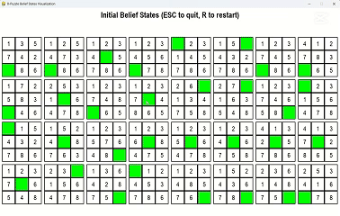 |
| **PartialObservationSearch** | 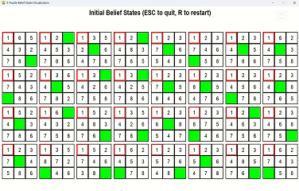 |
| **And_OrSearch** | 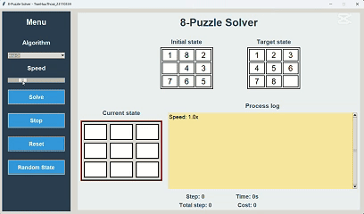 |

#### Hình ảnh so sánh hiệu suất
- Do yêu cầu loại bỏ so sánh nhóm Belief-State Search, hiệu suất của các thuật toán này không được đánh giá trong dự án hiện tại.

#### Nhận xét về hiệu suất
- **NoObservationSearch**: Phù hợp khi không có thông tin quan sát, nhưng tốn tài nguyên do phải xem xét nhiều trạng thái niềm tin.
- **PartialObservationSearch**: Hiệu quả hơn khi có thông tin quan sát nên giảm được đáng kể tập niềm tin, nhưng vẫn phức tạp hơn các thuật toán thông thường.
- **And_OrSearch**: Phù hợp với các bài toán có bất định trong kết quả hành động hoặc quan sát, nơi một hành động có thể dẫn đến nhiều kết quả khác nhau. Bị giới hạn độ sâu để duy trì hiệu quả. 
---

### 2.5. Các thuật toán Tìm kiếm ràng buộc: Backtracking, GenerateAndTest, AC3

#### Thành phần chính của bài toán tìm kiếm
-**Biến**: Mỗi biến đại diện cho một phần của trạng thái bài toán, và mục tiêu là gán giá trị cho tất cả các biến sao cho thỏa mãn các ràng buộc (Các ô trong bảng 3x3)
-**Miền giá trị**:  Tập hợp các giá trị có thể gán cho mỗi biến(Trong 8-puzzle, miền giá trị của mỗi ô là tập {0, 1, 2, 3, 4, 5, 6, 7, 8}, với 0 là ô trống).
- **Ràng buộc**: Các quy tắc hoặc điều kiện mà các biến phải thỏa mãn (Mỗi số từ 0 đến 8 xuất hiện đúng một lần, trạng thái đích phải đạt cấu hình cụ thể, Các bước di chuyển ô trống phải hợp lệ,...)
- **Trạng thái**: Một trạng thái trong CSP là một tập hợp các gán giá trị cho một số hoặc tất cả các biến (Một cấu hình của bảng 3x3)
- **Hành động**: Gán giá trị cho một biến chưa được gán hoặc thay đổi giá trị của một biến.
-**Hàm mục tiêu**: Tìm một trạng thái hoàn chỉnh thỏa mãn tất cả các ràng buộc
- **Solution**:  Lời giải là một chuỗi các trạng thái (bước di chuyển) từ trạng thái ban đầu đến trạng thái đích.

#### Hình ảnh GIF minh họa
| Thuật toán | GIF |
|------------|-----|
| **Backtracking** |  |
| **GenerateAndTest** |  |
| **AC3** | 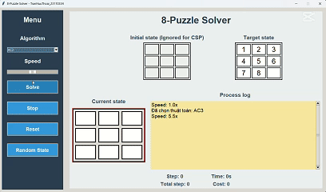 |

#### Hình ảnh so sánh hiệu suất
| Thời gian | Số trạng thái đã thăm | Bộ nhớ sử dụng |
|-----------|-----------------------|----------------|
| 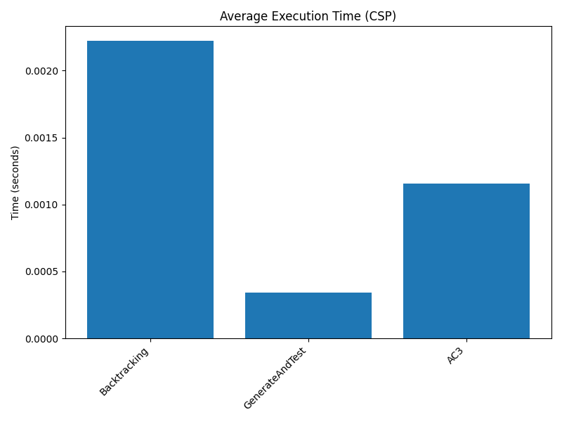 |  | 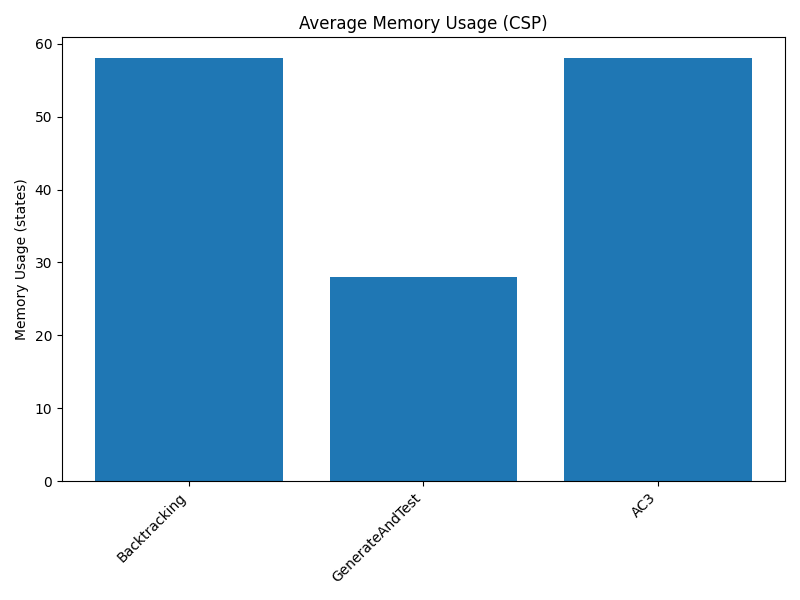 |

#### Nhận xét về hiệu suất
- **Backtracking**: Hiệu quả trong việc tìm giải pháp CSP, nhưng có thể chậm nếu không gian trạng thái lớn.
- **GenerateAndTest**: Đơn giản nhưng không hiệu quả do phải liệt kê tất cả trạng thái có thể.
- **AC3**: Giảm không gian tìm kiếm bằng cách loại bỏ các giá trị không hợp lệ trước, nhưng phức tạp hơn trong triển khai.

---

### 2.6. Học tăng cường: Q-Learning

#### Thành phần chính của bài toán tìm kiếm
-**Giá trị Q (Q-Value) hoặc Giá trị Hành độngn**: biểu thị phần thưởng kỳ vọng dài hạn khi thực hiện hành động a ở trạng thái s, sau đó tiếp tục theo một chính sách tối ưu. Đây là thước đo chất lượng của cặp trạng thái-hành động.
-**Phần thưởng (Reward)**:  Phần thưởng R là giá trị số mà tác nhân nhận được sau khi thực hiện hành động a ở trạng thái s, phản ánh mức độ mong muốn của hành động đó.
- **Tập phim (Episode)**: Một tập phim là một chuỗi các trạng thái, hành động, và phần thưởng, bắt đầu từ trạng thái ban đầu và kết thúc khi đạt trạng thái cuối (terminal state) hoặc sau một số bước tối đa.
- **Chênh lệch thời gian (Temporal Difference - TD) hoặc Cập nhật Q**: Giá trị Q được cập nhật dựa trên công thức TD, kết hợp phần thưởng hiện tại và giá trị Q ước lượng của trạng thái tiếp theo
- **Chính sách tham lam ϵ (Epsilon-Greedy Policy)**: Chính sách tham lam cân bằng giữa khai thác (Chọn hành động có giá trị Q cao nhất) và khám phá (Chọn hành động ngẫu nhiên)
- **Solution**:  Lời giải là một chuỗi các hành động (di chuyển ô trống lên, xuống, trái, hoặc phải) đưa bảng 3x3 từ trạng thái ban đầu đến trạng thái đích. Lời giải không được tạo ra trwucj tiếp mà alf kết quả của chính sách tối ưu được học từ bẳng giá trị Q sau khi huấn luyện.
#### Hình ảnh GIF minh họa
| Thuật toán | GIF |
|------------|-----|
| **Q-Learning** | 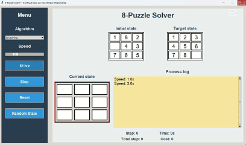 |

#### Hình ảnh so sánh hiệu suất
| Thời gian | Số trạng thái đã thăm | Bộ nhớ sử dụng |
|-----------|-----------------------|----------------|
| 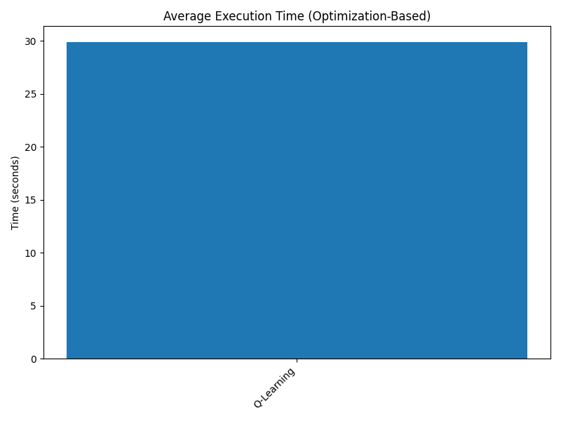 | 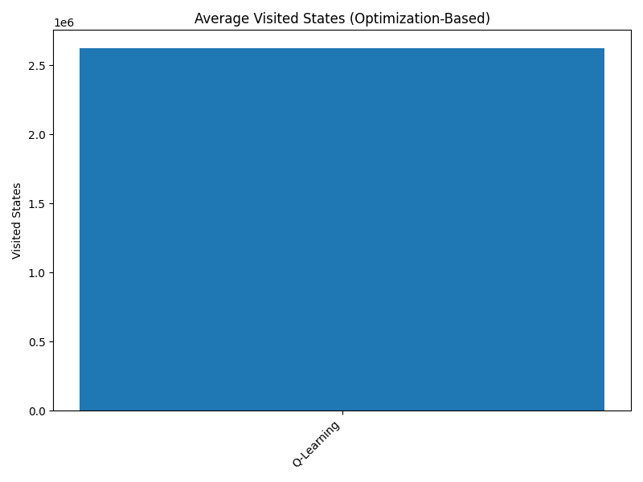 | 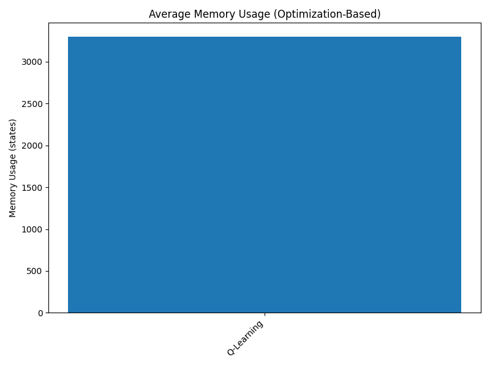 |

#### Nhận xét về hiệu suất
- **Q-Learning**: Tốn thời gian để huấn luyện do cần nhiều tập học, nhưng có thể áp dụng cho các bài toán mà không cần mô hình rõ ràng. Phù hợp hơn cho các bài toán lớn hoặc không xác định.

---

## 3. Kết luận
Dự án đã đạt được các kết quả sau:
- **Triển khai thành công 18 thuật toán** thuộc 6 nhóm khác nhau áp dụng cho bài toán 8-Puzzle.
- **Xây dựng giao diện người dùng** bằng Tkinter + Pygame, cho phép nhập trạng thái ban đầu và đích, chọn thuật toán, điều chỉnh tốc độ hiển thị, và xem quá trình giải chi tiết.
- **Đánh giá hiệu suất** của các thuật toán dựa trên thời gian thực thi, số trạng thái đã thăm, và bộ nhớ sử dụng.
- **Học được từ dự án**: Hiểu sâu hơn về cách áp dụng các thuật toán AI vào bài toán thực tế, kỹ năng lập trình Python.
-**Khó khăn trong việc thực hiện**: Một số thuật toán rất trừu tượng, khó hiểu nên có thể mô phỏng không đúng ý tưởng một số thuật toán; Đa số là tài liệu tiếng anh.
-**Hướng phát triển**: Trực quan hóa 1 cách rõ ràng ý tưởng cảu từng giải thuật, áp dụng để làm game cho đồ án nhóm cuối kỳ.

---

## Tài liệu tham khảo:

-**1**: Russell 2016 Artificial intelligence a modern approach
-**2**: Scaler Topics: https://www.scaler.com/topics/artificial-intelligence-tutorial
-**3**: Geeksforgeeks: https://www.geeksforgeeks.org/q-learning-in-python/

## 👨‍💻 Tác giả
**Trần Hữu Thoại**  
MSSV: `23110334`  
Môn: `Trí Tuệ Nhân Tạo`  
Giáo viên hướng dẫn: `Phan Thị Huyền Trang`