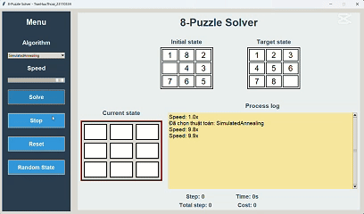

# 🔢 Đồ án cá nhân: 8-Puzzle Solver

## 🎯 Mục tiêu
Xây dựng một chương trình giải bài toán **8-Puzzle** sử dụng nhiều thuật toán tìm kiếm khác nhau trong lĩnh vực Trí tuệ nhân tạo.

---

## 🧠 Các thuật toán được triển khai

| Thuật toán | Mô tả ngắn |
|------------|------------|
| 🔍 **Breadth-First Search (BFS)** | Duyệt theo từng lớp, đảm bảo tìm được lời giải tối ưu nếu tồn tại. |
| 🧗‍♂️ **Depth-First Search (DFS)** | Duyệt theo chiều sâu, dễ bị mắc kẹt nếu không giới hạn độ sâu. |
| 💰 **Uniform Cost Search (UCS)** | Luôn mở rộng nút có chi phí thấp nhất đến hiện tại. |
| ⬇️ **Iterative Deepening DFS (IDDFS)** | Kết hợp ưu điểm của DFS và BFS bằng cách tăng dần độ sâu duyệt. |
| 🎯 **Greedy Best-First Search** | Mở rộng nút có giá trị heuristic nhỏ nhất. |
| ✨ **ASTAR** | Kết hợp giữa chi phí đi và ước lượng còn lại để tìm lời giải tối ưu. |
| 🔁 **IDASTAR** | Phiên bản lặp lại của A\\*, dùng ít bộ nhớ hơn. |
| ⛰ **Simple Hill Climbing** | Luôn chọn trạng thái con tốt hơn trạng thái hiện tại. |
| ⛰⛰ **Steepest Hill Climbing** | Chọn trạng thái con tốt nhất trong tất cả các trạng thái lân cận. |
| 🎲 **Stochastic Hill Climbing** | Chọn ngẫu nhiên trong các trạng thái lân cận tốt hơn. |
| 🔥 **Simulated Annealing** | Chấp nhận trạng thái kém hơn với xác suất, để tránh kẹt cực trị địa phương. |
| 🌈 **Beam Search** | Giới hạn số lượng nút được giữ lại tại mỗi bước (theo heuristic). |

---

### ✅ Cài đặt
```bash
git clone https://github.com/finntranne/TranHuuThoai_23110334_DoAnCaNhanTriTueNhanTao_8_puzzle.git
cd TranHuuThoai_23110334_DoAnCaNhanTriTueNhanTao_8_puzzle
python main.py
...

---

## 🚀 Demo GIFs

### Breadth-First Search (BFS)


### Depth-First Search (DFS)


### Uniform Cost Search (UCS)


### Iterative Deepening DFS (IDDFS)


### Greedy


### ASTAR


### IDA\\*


### Simple Hill Climbing


### Steepest Hill Climbing


### Stochastic Hill Climbing


### Simulated Annealing


### Beam Search

---

## 👨‍💻 Tác giả

**Tran Huu Thoai**  
MSSV: `23110334`  
Course: `Artificial Intelligence`  

---
